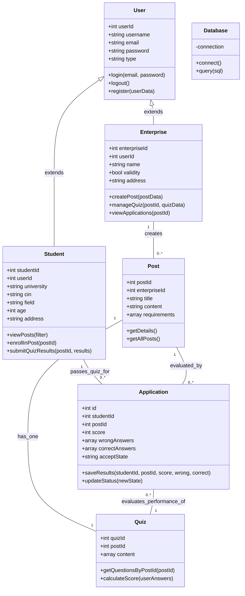

# Class Diagram: Stagify Backend (PHP) - Updated

This diagram represents the logical connection between the frontend interactions and the database schema, reflecting that every post has an associated quiz.

## Refined Logic Flow

1.  **Mandatory Assessment**: Every `Post` created by an `Enterprise` must have an associated `Quiz`.
2.  **Student Interaction**:
    *   A `Student` views a `Post`.
    *   The "Enrollment" process triggers the `Quiz` interface.
    *   Upon completion, `submitQuizResults` is called.
3.  **Candidature**: The `Application` class (mapping to the `passedUsers` table) serves as the bridge between a `Student` and a `Post`. It stores the results of the `Quiz` and the status of the application (`acceptState`).
4.  **Visibility Logic**:
    *   If `acceptState` is **accepted**: Enterprise sees full details (email, age, address, specialty).
    *   If `acceptState` is **rejected** or **pending**: Enterprise only sees specialty and age.
5.  **Data Persistence**: All classes interact with the `Database` utility for CRUD operations.
